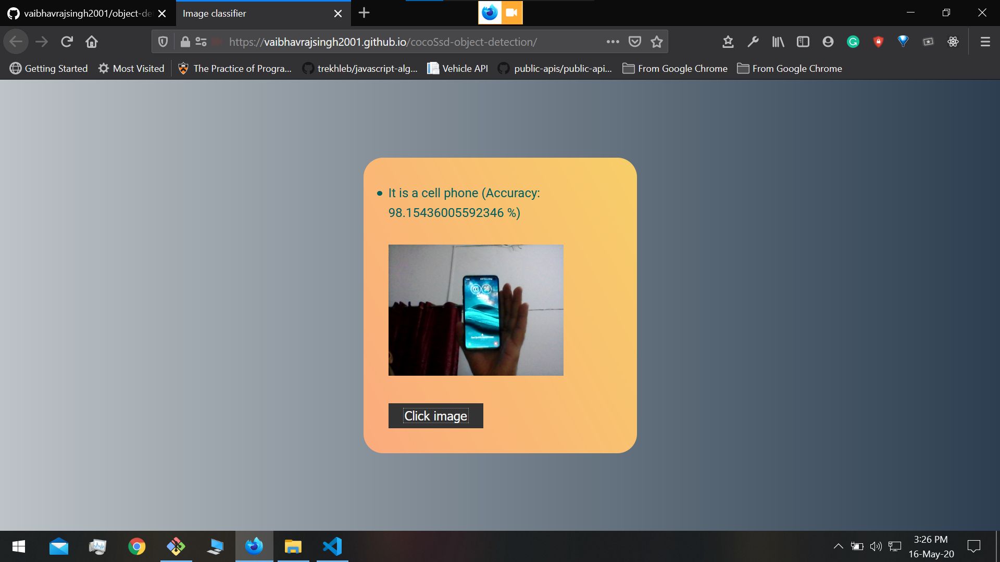

# Object detection through TensorFlow JS

A simple implementation of the cocoSsd model. The bundled files are in [/dist](https://github.com/vaibhavrajsingh2001/object-detection-using-cocoSsd/tree/master/dist).

Access at: https://kutt.it/object-detection

Wait for the model to be loaded (about 6-7 seconds, depending on the quality of connection)
and then click the image of whatever object you want to try on.

